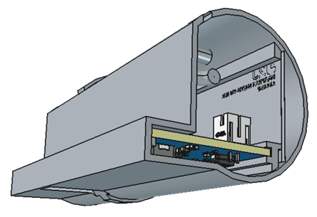

# Entrylens

A door-mounted people-counting sensor using a VL53L8CX time-of-flight sensor and RAK3172 (STM32WLE5)
to detect and count people and report the counts over LoRaWAN (EU868).

## Hardware

The design documentation is provided in DESIGN.md.

The electronics are designed in [EasyEDA Pro](https://pro.easyeda.com) with assistance from
Claude Code (Anthropic), [pcba-design-skills](https://github.com/Keitark/pcba-design-skills), and
[pcb-checklist](https://github.com/azonenberg/pcb-checklist).

The enclosure is designed in [FreeCAD](https://www.freecad.org).

The PCB can be manufactured through [JLCPCB](https://jlcpcb.com), and the enclosure through
[JLC3DP](https://jlc3dp.com/). The reproduction cost is approximately USD 40 per unit in a small
production batch of approximately 20 units.

## Firmware

In development.

## License

Hardware design files are licensed under [CERN-OHL-W](https://cern-ohl.web.cern.ch).
