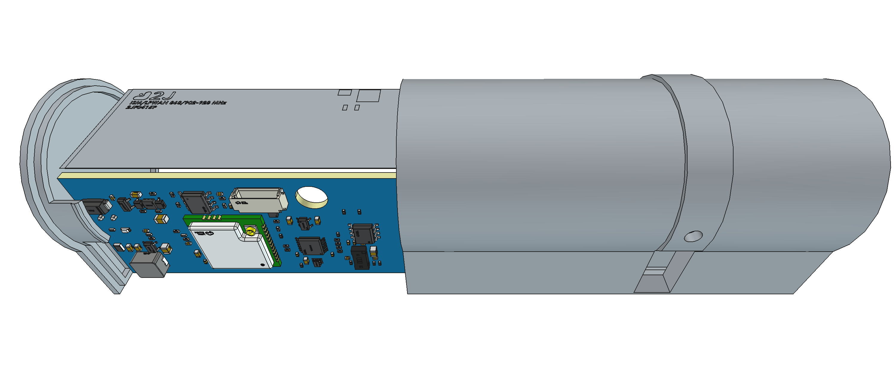

# Design

This document covers design intent, architecture, and components of the Entrylens sensor. Exact
passive values, pin assignments and net connectivity are in the netlist/BOM.

## 1. Intended Use

Entrylens is an indoor people-counting sensor for museums and exhibition areas. One unit is
installed at each door opening; it counts pedestrian traffic and transmits the counts wirelessly
for occupancy calculation and analysis.

The device is intended for professional installation by technical personnel responsible for
building or museum technology.

It is an open-hardware reference design, intended to support subsequent conformity assessment and
reproduction for own use.

The target reproduction cost is about USD 40 per unit, assuming a small batch of about 20 units.

## 2. Usage

This section defines the deployment conditions, operating envelope and functional limitations of
the device. Sections 3-5 describe how they are met.

### 2.1 Deployment

The device is mounted centrally on the lower rear edge of the head jamb, opposite the door leaf,
and secured with 15 mm wide double-sided adhesive tape.

The aperture must not receive direct sunlight, as ambient infrared reduces the ranging accuracy.

The 45 degree field of view covers a 2.07 m wide strip at 250 cm mounting height; mounting lower
narrows it proportionally. The reference installation was tested on a double-leaf doorway, 250 cm
high and 130 cm wide.

The device is continuously powered over a two-wire cable from an external DC supply. The supply
must provide a SELV output, 5 V nominal, rated between 500 mA and 2 A; the 2 A maximum limits the
fault current in the cable. The cable may be up to 20 m long and must have 0.33 mm2 (22 AWG)
copper conductors, which keeps the input above the 3.5 V minimum. Copper-clad aluminium must not
be used.

Wireless network credentials are configured from a mobile application and transferred over NFC-V
(ISO/IEC 15693). The configuration is protected by a 64-bit password and remains accessible when
the device is unpowered.

### 2.2 Operation

The device continuously detects and counts people entering and leaving, using a distance-measuring
sensor; it captures no images or other visual data.

The device is designed for bidirectional traffic of individuals and groups of up to two people
abreast, walking at up to 1.5 m/s. Under the specified operating conditions the target counting
accuracy is 95 %.

The design service life is 10 years of continuous operation.

A two-colour (red/green) status LED, controlled by the MCU, is visible from outside the
enclosure. A red power LED is visible only with the lid removed.

The antenna must remain connected whenever the board is powered; powering the RAK3172 with the
U.FL connector unmated may damage its RF section.

### 2.3 Maintenance

No routine physical maintenance is required. Firmware updates and diagnostics can be performed
remotely where wireless connectivity is available.

### 2.4 Service

The debug/programming connector inside the enclosure gives access to detailed device status and is
used for troubleshooting, firmware updates and production programming. It is not connected during
normal operation.

The debug connector must not be used to power the device; the debugger's target power output must
be disabled.

Labelled test pads on the top side give probe access to +5V, +3V3, +1V8, the switched sensor
supply (+3V3_TOF, at the sensor), the eFuse FAULT signal and GND (two pads).

### 2.5 Operating environment

The device is designed for indoor use in ordinary environments such as museums and exhibition
spaces. It is not intended for industrial environments or hazardous areas.

- Temperature: 0 to 40 C
- Relative humidity: 10 to 90 % RH, non-condensing
- Vibration/shock: none expected
- Ingress protection: none declared

## 3. Mechanical

### 3.1 Composition

The device is composed of:
- an enclosure made from Nylon PA12S, modelled in `EntrylensHousing.FCStd`
- the PCB, described in Section 4
- a light pipe (FIX-LEMB3-5V0-F) that makes the red/green status LED visible from outside
- an 868 MHz antenna board (2JF0415P), whose 100 mm U.FL/IPEX cable connects directly to the
  RAK3172

### 3.2 Arrangement

The enclosure is a compact cylinder, 85 mm x 40 mm, with a removable lid for access to the
electronics. There are no external antennas or other protruding parts; only the power cable
enters, through a strain relief.

The VL53L8CX looks vertically down through a tapered aperture in the enclosure wall.

The 82 mm x 29 mm PCB and the antenna board are mounted perpendicular to each other. Both are
retained by rails that engage the clear keepout areas along the long edges of the PCB, rather than
by mounting holes or screws.

A 6 mm non-plated hole in the PCB gives clearance for the U.FL/IPEX cable from the RAK3172 to the
antenna board.

## 4. Hardware

### 4.1 Architecture

The PCB integrates the following functional blocks:
- Power input
  - 2-pin JST XH connector (B2B-XH-A(LF)(SN))
  - Input protection chain, described in Section 4.2
  - 3.3 V buck converter (TLV62569)
  - Ferrite bead (MPZ2012S331ATD25) filtering high-frequency noise
- MCU and LoRaWAN transceiver module (RAK3172, based on STM32WLE5)
- Debug/programming interface
  - 7-pin JST SR connector (SM07B-SRSS-TB)
  - ESD protection (GMF05LC-HSF)
- 4 Mbit NOR flash (P25Q40SH)
- Voltage and logic level conversion to 1.8 V
  - 1.8 V LDO regulator (MIC5504) with output discharge, switched by the MCU
  - 4-channel level shifter (LSF0204)
- ToF ranging sensor (VL53L8CX)
  - AVDD load switch (TPS22919), switched by the MCU
- Dynamic NFC/RFID tag (ST25DV04KC) with a 512-byte EEPROM
  - Antenna coil on PCB (ST25DV_Discovery_ANT_C6)
- Two LEDs: a power indicator (KT-0603R) and a status indicator (LTST-C295KGKRKT)

The LoRa antenna is placed away from the NFC antenna coil to minimize coupling.

### 4.2 Power

The device is powered over a cable up to 20 m long, so the input stage is built to survive
miswiring and cable transients. It operates from 3.5 to 5.5 V, which covers a 5 V supply's
tolerance, and withstands +/- 9 V of wrong polarity or overvoltage for at least 1 h.

The input protection chain, in order:

| Part | Function |
|---|---|
| SMAJ10CA    | Input surge absorption |
| AO3401A     | Reverse-polarity block |
| BZX384-C6V2 | AO3401A Vgs clamp |
| BZX384-C6V2 | Holds TPS25200 EN below its 7 V rating through the +/- 9 V withstand |
| TPS25200    | Overcurrent, overvoltage and overtemperature protection |

The TPS25200 EN pull-up is stronger than the datasheet value, so leakage cannot pull EN below its
threshold at 3.5 V in.

TPS25200 FAULT disables the TLV62569 during overcurrent, overtemperature or overvoltage lockout.
The FAULT pull-up sits on the TPS25200 output rather than on +3V3, so losing that output also
removes the TLV62569 enable, even if FAULT fails to assert.

| Rail | Nominal | Worst case | Bound by |
|---|---|---|---|
| +5V      | clamped 5.25 - 5.55 V | | TPS25200 output clamp |
| +3V3     | 3.288 V | 3.212 - 3.365 V | VL53L8CX AVDD 3.13 - 3.47 V |
| +3V3_TOF | | 3.178 - 3.422 V | VL53L8CX AVDD 3.13 - 3.47 V |
| +1V8     | 1.800 V | 1.703 - 1.858 V | VL53L8CX 1.62 - 1.98 V |

The +3V3_TOF worst case adds the TLV62569 light-load rise (+1.7 %, typical curve) and the drops
through the ferrite bead and the TPS22919; the TLV62569 feedback resistors are therefore 0.1 %
parts. The +1V8 worst case uses the MIC5504 +/- 3 % over temperature plus its full-range load and
line regulation.

The RAK3172 monitors +5V through an ADC divider.

The +1V8 rail is enabled by an MCU GPIO with a pull-down, so it stays off until firmware enables
it and can be cycled. When disabled, the MIC5504 actively discharges the rail. Its turn-on time
(125 us max at 1 uF) meets the VL53L8CX minimum supply slew rate; the rail carries more than 1 uF
including local decoupling, so the ramp is confirmed at bring-up.

Firmware must configure the 1.8 V side GPIOs before enabling the rail, because the LSF0204 has no
internal pull-ups.

FAULT is not asserted while only the TPS25200 output clamp is engaged. Between the clamp and the
overvoltage lockout (6.8 - 8.45 V in), the device keeps running with +5V held at 5.4 V. The
TLV62569 input then reaches 5.55 V, over its 5.5 V recommended maximum but inside its 6 V limit;
this is accepted for a fault condition.

| Input at lockout | TPS25200 dissipation | TJ at 40 C |
|---|---|---|
| 6.8 V  | 0.30 W | 60 C |
| 8.45 V | 0.66 W | 84 C |

The device is continuously active in normal operation and does not use deep-sleep modes.

The peak current budget below treats VL53L8CX ranging and RAK3172 transmission as concurrent:

| Component | +3V3 | +1V8 |
|---|---|---|
| VL53L8CX        | 60 mA  | 100 mA |
| RAK3172         | 120 mA | |
| P25Q40SH        | 4 mA   | |
| ST25DV04KC      | 1 mA   | |
| KT-0603R        | 12 mA  | |
| LTST-C295KGKRKT | 22 mA  | |
| Total           | 219 mA | 100 mA |

The +3V3 rail supplies 319 mA including +1V8, against a TPS25200 current limit of 428 mA
(366 - 495 mA).

At its 100 mA share the MIC5504 runs at TJ 78 - 82 C, against a 125 C limit.

### 4.3 MCU (RAK3172)

BOOT0 is not connected, and the design does not rely on RAK's undocumented internal pull-down.
Instead, option bytes nSWBOOT0 = 0 and nBOOT0 = 1, set during production programming
(Section 2.4), select boot from main flash. This disables the bootloader fallback; recovery uses
SWD.

The STM32WLE5 independent watchdog (IWDG) reboots the device if the firmware becomes unresponsive.

Brown-out reset (BOR) stays enabled. Below the BOR threshold the MCU is held in reset until the
supply recovers and then boots normally, so short interruptions and undervoltage give a clean
restart rather than degraded operation.

### 4.4 Debug/programming interface

Debugging and programming use a 7-pin JST SR connector. Its pinout is also printed on the bottom
silkscreen:

- 1: UART_RX
- 2: UART_TX (MCU output)
- 3: GND
- 4: NRST
- 5: SWCLK
- 6: SWDIO
- 7: VREF out

Either an ST-LINK or a DAPLink debugger can be used. UART2 alongside SWD provides the status access
of Section 2.4.

Pin 7 is the debugger's voltage reference only; the board is always powered from its power
connector.

The connector signals are protected as follows:

| Part | Function |
|---|---|
| GMF05LC-HSF     | ESD protection of pins 1, 2 and 4-6 |
| Series resistor | Current limiting on pin 7 (VREF out) |

### 4.5 External flash (P25Q40SH)

The flash stores the VL53L8CX firmware image and, during FOTA updates, the staged MCU application
image.

/WP and /HOLD are pulled high and not MCU-controlled, so hardware write protection is unavailable.

### 4.6 ToF sensor (VL53L8CX)

The detection field of view is 45 degrees horizontally and vertically.

The enclosure aperture has no cover glass, so no crosstalk calibration is required.

An ESD clearance area surrounds the sensor aperture, so the sensor decoupling capacitors sit at its
edge rather than next to the pins.

The sensor is used in I2C mode, with the bus at 1 MHz.

The ST25DV04KC requires Rbus x Cbus below 150 ns at 1 MHz. With the fitted pull-ups this allows
45 pF on the MCU side of the LSF0204, so those traces must be kept short.

To fully reset the sensor, the MCU switches off both AVDD (through the TPS22919 load switch) and
+1V8. Both rails are actively discharged, so the 10 ms off time of UM3109 applies.

The footprint uses plain rectangular pads and deviates from ST's recommendation in two places.
Pads B1 and B7 are 0.500 mm instead of 0.535 +/- 0.030 mm, 0.005 mm beyond tolerance, which is
accepted as negligible. The thermal pad has 5 stitched vias instead of the 8 shown in AN5897,
because more do not fit the fabricator's via rules.

### 4.7 NFC (ST25DV04KC)

Energy harvesting is disabled in the device configuration, and V_EH is intentionally left
unconnected.

The antenna is a PCB coil following the ST25DV_Discovery_ANT_C6 reference design
(ANT-1-6-ST25DV):
- Turns: 15
- Size: 18.5 mm x 22.7 mm
- Trace width / spacing: 0.2 mm / 0.2 mm
- Copper: 1 oz (35 um)
- Copper beneath the coil on other layers: none
- Inductance at 13.56 MHz: 4.71 uH

### 4.8 PCB

The board has 4 layers, stacked Signal / GND / Power / Signal in JLCPCB's standard stackup: one
0.21 mm sheet of 7628 prepreg under each outer layer and a 1.065 mm core between the planes.

No trace needs controlled impedance. The 868 MHz signal leaves through the RAK3172's IPEX
connector, and the 13.56 MHz NFC coil is electrically short, so it acts as a lumped inductor.

Fabrication:
- Material: FR-4 TG135
- Thickness: 1.6 mm
- Copper: 1 oz on outer layers, as the NFC coil requires, and 0.5 oz on inner layers
- Surface finish: HASL with lead
- Vias: epoxy filled and capped, so thermal-pad vias do not draw solder from the joint
- Marking: 5 x 5 mm 2D barcode with a serial number ABCDE_0001

Assembly is SMT on the top side only; the power connector is through-hole and hand-soldered.

The VL53L8CX (MSL 3) package is not sealed, so assembly uses no-clean solder paste and no washing
(DS14161 12.6). The leaded HASL finish means leaded solder paste instead of ST's recommended
SAC305, accepted for its lower reflow peak.

Leaded solder is acceptable because RoHS does not apply (Section 6).

## 5. Software

Firmware is custom and bare-metal (no RUI3), built with STM32CubeIDE and programmed via SWD.

### 5.1 Bootloader

The bootloader checks whether a valid FOTA image is available in external flash. If so, it
installs the image and then boots the sensing application; an incomplete or invalid image is not
installed.

There is no rollback: a device that crashes immediately on boot after an update requires manual
maintenance.

### 5.2 Sensing application

The device operates as a LoRaWAN Class A device in the EU868 band. OTAA and ABP activation are
both supported; the choice is set via NFC provisioning.

Event counters are aggregated and uplinked within 5 minutes of a detection, subject to duty-cycle
limits. This window bounds the reporting latency while leaving duty-cycle margin for FOTA
downlinks.

The device keeps no synchronized wall-clock time, so events are associated with the network-server
reception timestamp rather than a precise local detection timestamp.

Counters are cumulative and volatile; no counter state is written to non-volatile memory. Any
reset or supply interruption restarts them at zero, and each uplink carries the cumulative value
and a reboot indicator so the network server can reconcile the discontinuity.

### 5.3 FOTA update

Firmware chunks received via LoRaWAN downlinks are staged in the P25Q40SH. Once a digital
signature has verified the image's authenticity and integrity, the bootloader is invoked to
install it.

## 6. Compliance

Entrylens units are built by the party that uses them, for its own use, so they are never placed
on the market (Commission Blue Guide on EU product rules, 2022/C 247/01, Section 2.3). Each unit
is only put into service, as defined in Directive 2014/53/EU (Radio Equipment Directive, RED),
Article 2(1)(11).

The RED still applies, as it also covers putting into service (RED Article 1(1)). Whoever puts a
unit into service takes on the manufacturer's responsibility for compliance and conformity
assessment (Blue Guide, Section 3.1).

Formal conformity assessment and testing have not yet been completed.

EMC immunity levels are not declared at design time; they are set at conformity assessment.
Instead, the power input is designed to tolerate what a 20 m indoor cable produces: hot-plug
ringing, coupled switching transients and miswiring.

The applicable RED essential requirements are:
- Article 3(1)(a): health and safety
- Article 3(1)(b): electromagnetic compatibility
- Article 3(2): effective and efficient use of radio spectrum

The RED Article 3(3)(d)-(f) cybersecurity requirements (Delegated Regulation (EU) 2022/30) do not
apply: the device operates on a LoRaWAN network with no internet connection and processes no
personal data.

Directive 2011/65/EU (RoHS) does not apply, because it restricts hazardous substances only in
equipment placed on the market (RoHS Article 4(1)).

Conformity is intended to be demonstrated with these harmonised standards:
- ETSI EN 300 220-2, applicable to the 863-870 MHz LoRa radio interface
- ETSI EN 300 330, applicable to the 13.56 MHz NFC interface
- ETSI EN 301 489-1 and EN 301 489-3, applicable to electromagnetic compatibility

EN IEC 62368-1 may be used as a supporting safety standard, subject to confirmation of its
applicability to the final equipment configuration.
